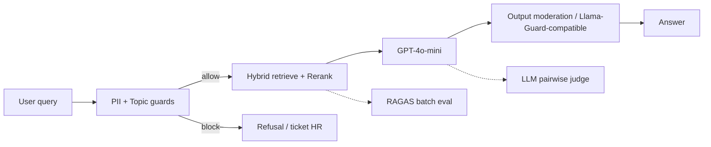

# Blueprint 1-pager — Production RAG + Eval + Guard + Judge

**Hệ thống:** RAG sổ tay nhân viên (chunk hybrid BM25+dense → rerank → GPT-4o-mini).  
**Deliverable rubric:** RAGAS (54 câu / 3 phân phối), Guardrails (Presidio/regex PII + topic + moderation đầu ra), LLM-Judge (pairwise + swap + Cohen κ), vận hành (SLO, sơ đồ, playbook, cost).

---

## SLO (Service Level Objectives)

| Chỉ tiêu | Mục tiêu | Đo |
|----------|----------|-----|
| Faithfulness (RAGAS) | ≥ 0.75 | `reports/ragas_report.json` aggregate |
| Context recall | ≥ 0.75 | idem |
| P95 latency guard chain | ≤ 500 ms (không gọm LLM generation) | `run_blueprint_deliverables.py` |
| Block rate adversarial input | ≥ 80% trên bộ 20 mẫu lab | `reports/guardrails_report.json` |
| Judge–human agreement | Cohen κ ≥ 0.6 trên 10 cặp | `reports/llm_judge_report.json` |

---

## Kiến trúc (logical)

Chi tiết module: `src/pipeline.py`, `src/guardrails.py`, `src/m4_eval.py`, `src/llm_judge.py`.

---

## Alert playbook (rút gọn)

| Alert | Nguyên nhân có thể | Hành động |
|-------|-------------------|-----------|
| Faithfulness drop >10% | Prompt generation lỏng, chunk quá nhỏ | Rollback prompt; tăng child chunk; kiểm tra enrichment |
| Context recall drop | Index corrupt / embed model đổi | Re-index; khóa phiên bản model |
| P95 guard > SLO | Presidio cold start / API moderation chậm | Warm pool; cache analyzer; tách async moderation |
| Cohen κ giảm | Judge prompt drift; nhãn human không đồng bộ | Freeze judge prompt; đào tạo lại annotator |
| Adversarial allow rate tăng | Topic keywords quá rộng | Thu hẹp `_HANDBOOK_KEYWORDS`; thêm deny-list |

---

## Cost analysis (ước lượng vận hành)

Giả định: 10k query/ngày; ~800 token prompt + 300 token completion/query; eval batch 1 lần/ngày full 54 câu.

| Hạng mục | Đơn vị | Ghi chú |
|----------|--------|---------|
| GPT-4o-mini generation | ~$ / 1M tokens | Chiếm phần lớn biến phí |
| Embeddings (RAGAS / retrieval) | embedding calls | RAGAS batch chạy định kỳ, không online |
| Moderation API | calls/query | Có thể sampling (vd. 10%) sau khi stable |
| Presidio | CPU | Self-host ~ negligible vs LLM |

**Tối ưu:** cache retrieval cho FAQ; giảm top-k trước rerank; CI chỉ subset câu hỏi.

---

## Llama Guard 3 & moderation

- **Production khuyến nghị:** endpoint Llama Guard 3 (HF gated / inference provider) trên đầu ra.
- **Repo này:** `LLAMA_GUARD_BACKEND=openai_moderation` làm proxy khi chưa có model gated; `hf` dùng stub + keyword jailbreak; `none` bỏ qua cho debug.

---

## Bias LLM-Judge (ghi nhận)

- Position bias giảm bằng **swap-and-average** (`src/llm_judge.py`).
- Vẫn có thể lệch khi một đáp án dài hơn hoặc có số liệu ngẫu nhiên — theo dõi `positional_bias_incidents` trong `reports/llm_judge_report.json`.
